# 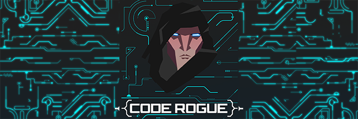

## Factsheet

**Developer:**  
CodeRogue Studio

**Founding date:**  
July 15, 2014

**Website:**  
[coderoguestudio.com][homepage]

**Press / Business contact:**  
[contact@coderoguestudio.com][contact]

**Social:**  
[twitter.com/coderoguestudio][twitter]  
[facebook.com/coderoguestudio][facebook]  
[Skype](callto:CodeRogueStudio)

**Releases:**  
[Hungrymons][hungrymons]

**Address:**  
Sao Paulo, Brazil

**Phone:**  
+55 (11) 99310-5666

## Description

CodeRogue Studio is a brand new game studio based in Sao Paulo, Brazil. They have just released their first game, called Hungrymons, on the two major mobile platforms, available for iOS and Android.

## History

### The story
CodeRogue Studio was founded by Marcelo Vitoria and Joao Arthur Navarro, after much talking, studying and a couple of prototypes. Along with the technical skills and creativity, they decided it was time to start making games for real, and have been pursuing this dream more seriously. They've worked in their first title, Hungrymons, following the idea to deliver a simple, casual, and yet fun and addictive experience to the mobile platforms. They now want to continue to explore new grounds and push their boundaries to achieve one goal, and one goal only: Make fun games!

### The team
Marcelo has been a programmer for over ten years, and has always been passionate about technology, programming languages, SDKs and frameworks, not to mention his care and effort to always write the best code he can.

Joao Arthur is the image of the perfectionist designer, always careful to the minimum details, he has been working with graphics design and 3D modelling for a long time, and will make sure all the pixels and polygons are pretty well polished before consider the job done.

## Projects

* [Hungrymons][hungrymons]

## Videos

Hungrymons short gameplay video:

<iframe src="https://www.youtube.com/embed/o8wdq5sCS5c" frameborder="0" allowfullscreen></iframe>

## Images

download all screenshots & photos as ** [.zip (0.9 MB)](assets/images/images.zip "Images zip") **

[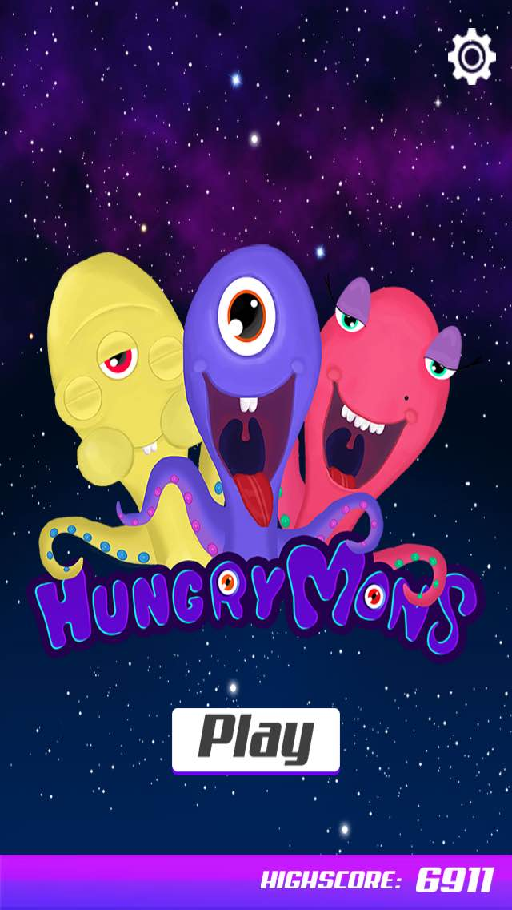](assets/images/ss_01.jpg)
[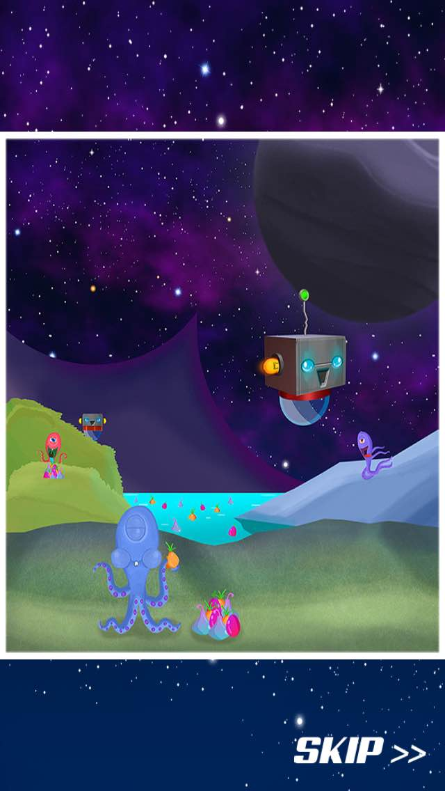](assets/images/ss_02.jpg)
[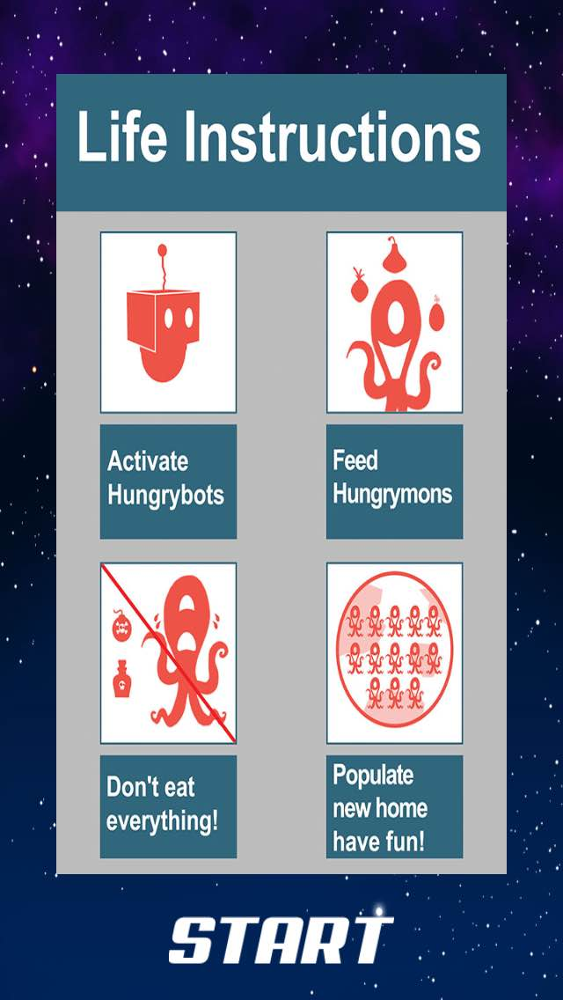](assets/images/ss_03.jpg)

[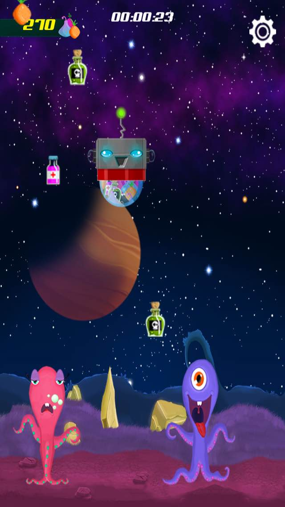](assets/images/ss_05.jpg)
[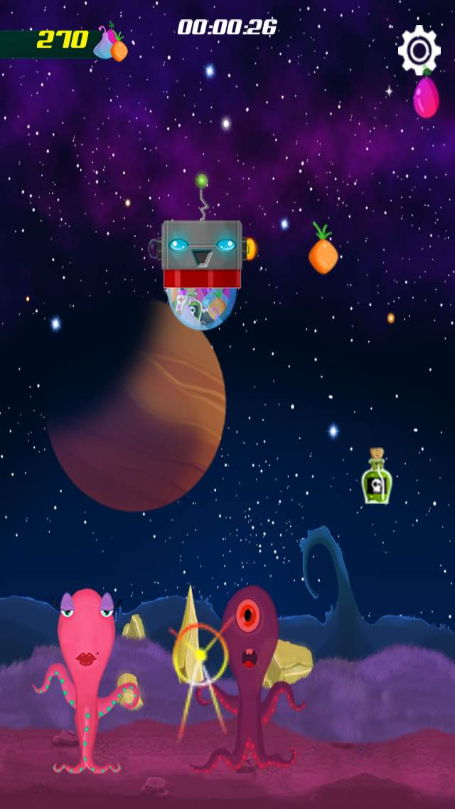](assets/images/ss_06.jpg)
[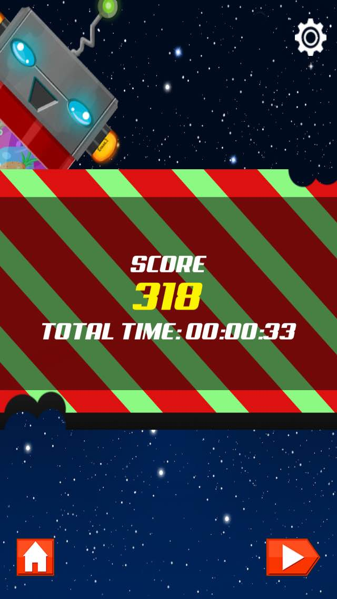](assets/images/ss_07.jpg)
[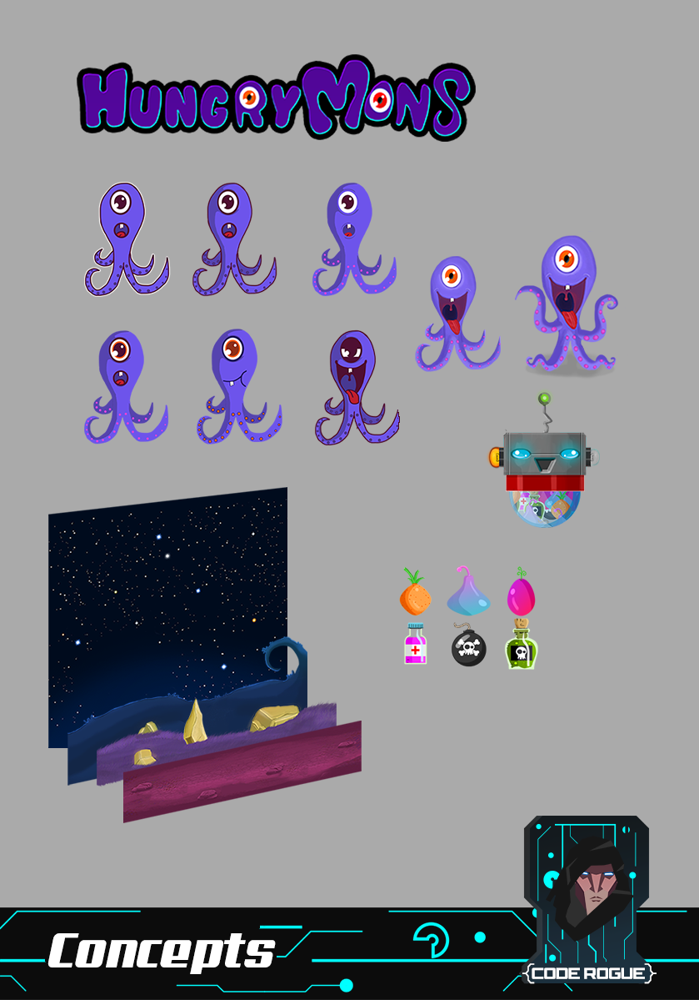](assets/images/image_01.png)
[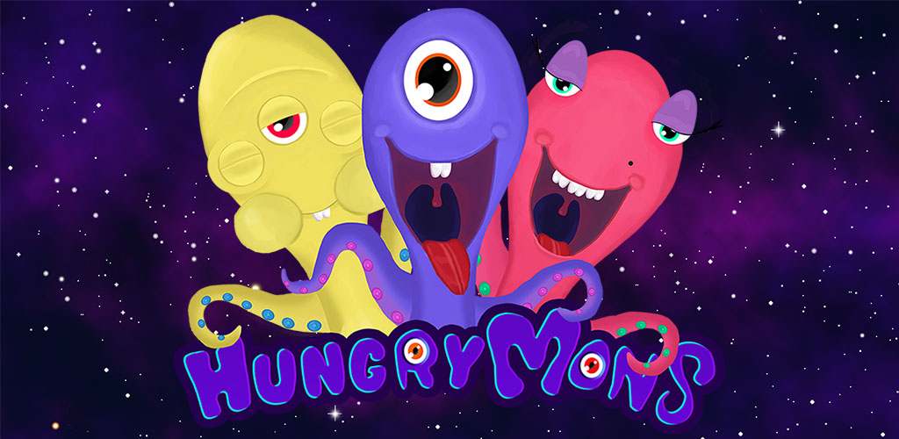](assets/images/image_02.jpg)
[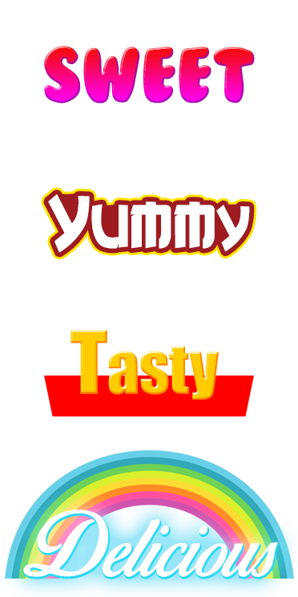](assets/images/image_04.png)

## Logo & Icon

download logo files as ** [.zip (75 KB)]( assets/images/logo.zip "Logo & Icon zip") **

[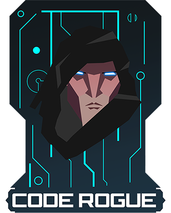](assets/images/logo.png "Logo")

## Awards & Recognition

> * None yet.

## Selected Articles

> * None yet.

## Team & Repeating Collaborator

**Marcelo Vitoria ([@MarcVit](https://www.twitter.com/marcvit))**  
programming & game design

**Joao Arthur Navarro ([@Litsoh_Navarro](https://www.twitter.com/litsoh_navarro))**  
art & game design

## Contact

**Inquiries**  
[contact@coderoguestudio.com][contact]

**Twitter**  
[twitter.com/coderoguestudio][twitter]

** Facebook**  
[facebook.com/coderoguestudio][facebook]

**Web**  
[coderoguestudio.com][homepage]

<!--- =====================================================================  -->
<!--- Referenced links -->

[homepage]: http://www.coderoguestudio.com "CodeRogue Studio"

[contact]: mailto:contact@coderoguestudio.com

<!--- Social -->

[twitter]: https://twitter.com/coderoguestudio
[facebook]: https://facebook.com/coderoguestudio
[skype]: callto:CodeRogueStudio

<!--- Projects  -->

[hungrymons]: ../../games
